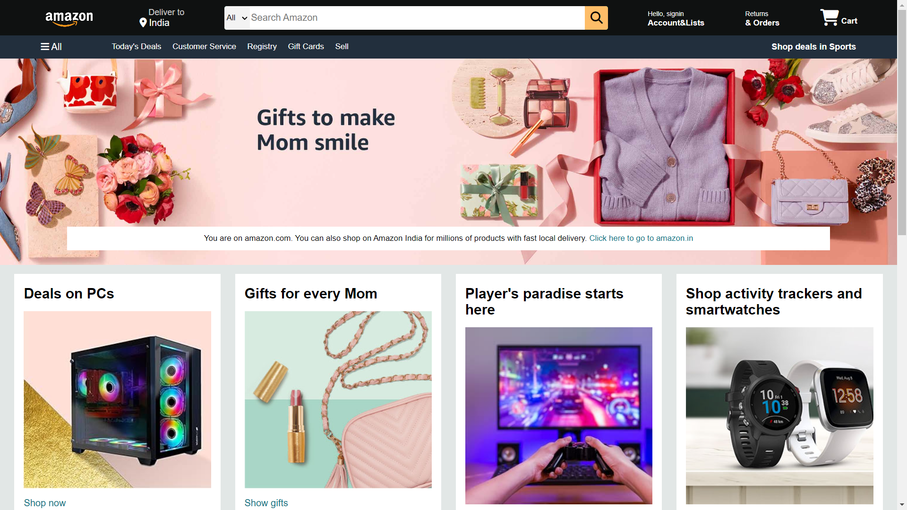

# Amazon Clone Project

This is a front-end Amazon clone built using **HTML** and **CSS**. It replicates the look and feel of the Amazon website to showcase web development skills, focusing on layout, design, and responsiveness.

## 🚀 Features

- **Homepage**  
  A layout inspired by Amazon’s homepage, including navigation bars, product categories, and promotional banners.

- **Product Listings**  
  Displays multiple products with images, titles, prices, and descriptions.

- **Responsive Design**  
  Fully responsive layout that adapts to different screen sizes (mobile, tablet, desktop).

## 🛠️ Technologies Used

- **HTML5** – For structuring the content of web pages  
- **CSS3** – For styling, layout, and responsive design techniques

## 📸 Screenshots

  
*Homepage of the Amazon Clone*

## View Live
To view this project [Click Here](amazonclone31.vercel.app)

## 🗂 Version Control

This project uses **Git** for version control and is hosted on **GitHub** for easy collaboration and tracking changes over time.

## 🤝 Contributing

Contributions are welcome!  
This project is intended for learning and demonstration. Feel free to fork the repository, explore the code, and customize it as needed.

## 🙌 Credits

This project was inspired by Amazon’s website design and developed by [Harshitha Chowdary Alasyam](https://github.com/alasyam31).
